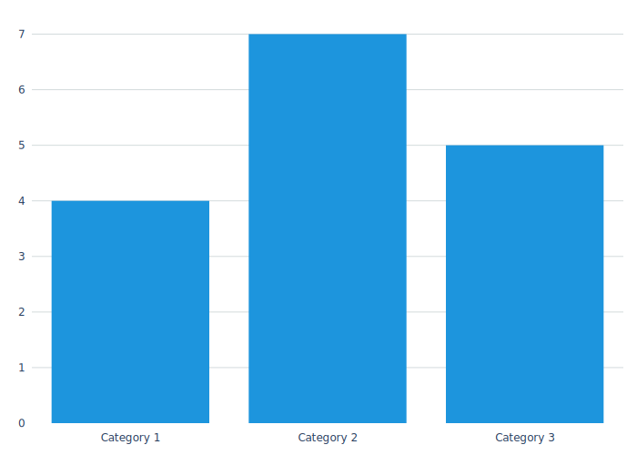
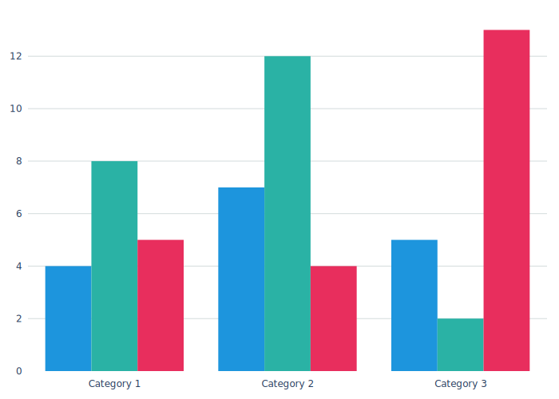
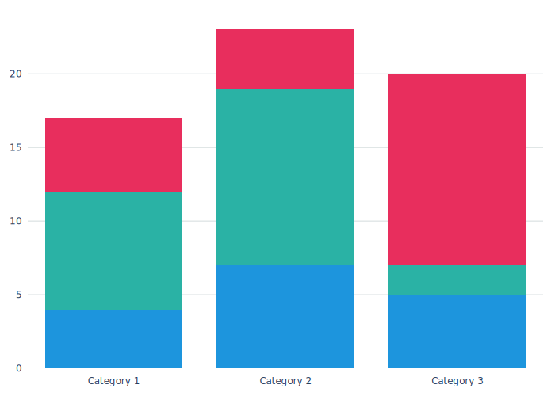

# Hello World

ChAsm as a library is designed to use sane and logical defaults for every single configuration option. This is a core design philosophy. Using this library should require the absolute bare-minimum configuration needed for an elegant result. The only two things that are required for basic chart generation is (1) a chart type, and (2) mostly-correctly formed data. Generating a chart takes the form of a ChAsm command like this:

```bash
# Passing Data Directly
chasm make bar --data '[{"x":"Category 1", "y0":10},{"x":"Category 2", "y0":15}]' -o path/chart1.svg

# Passing Data as a File
chasm make bar --data data/simple_bar.data.json -o path/chart1.svg

# Passing Data from a File Using Bash Evaluation
chasm make bar --data "$(cat data/simple_bar.data.json)" -o path/chart1.svg
```

Each of these commands would produce a default chart that looks like this.



A couple things to notice.

The `--data` argument must always evaluate to a list of dictionaries. This is non-negotiable in ChAsm, and many of the features included in this library depend on this base assumption that the root data structure is a list of dictionaries. 

```json
# Simplest Data Form

[
    {
        "x": "Category 1",
        "y": 4
    },
    ...
]
```

The `--data` argument may also be a string representation of JSON or a pointer to a file that contains valid JSON. ChAsm will figure out which one you've used, so no need to be specific. The idea is for this library to assume sane defaults for _everything_, including data sources, formats, and structures.

Additionally, `x` and `y` (`y0`, `y1`, `y2`, etc.) are assumed to be the default keys for the x and y coordinates of our data, so no need to specify x and y keys if they follow this default naming. Additional enumerations of y (y1, y2, y3, etc.) are used when multiple series are included in our dataset. The only rule is that every data point must be the same structure as every other data point.

This is valid:

```
[
    {
        "x": "Category 1",
        "y": 4
    },
    {
        "x": "Category 2",
        "y": 8
    },
    ...
]
```

This is valid:

```
[
    {
        "x": "Category 1",
        "y4": 4
    },
    {
        "x": "Category 2",
        "y4": 8
    },
    ...
]
```

This is NOT valid:

```
[
    {
        "x": "Category 1",
        "y": 4
    },
    {
        "x": "Category 2",
        "y1": 8
    },
    ...
]
```

With default settings the data parser assumes that `x` is the x-axis key, and y-keys match the regex `^y\d*$`, which is to say a `y` followed by zero or more digit values. `y` is valid, `y10` is valid, `y2389` is valid, `y1y` is not valid. 

One core assumption of ChAsm is that for essentially every chart type there is one and only one category (generally x) key. Meaning, the key `x` is present in every single data point and there is never more or less than a single `x` (category) key. For the data keys (typically `y`) there may be `N` keys, one for each series. 

Changing of these is absolutely possible, but outside the scope of this basic Hello World tutorial. Once we get into chart configuration layers we will see the many ways in which we can control the data keys.

This key parsing means that providing a data series with multiple `y` keys will automatically render a chart with multiple series. 

Here's an example command and dataset (provided in the examples folder of this project).

```bash
chasm make bar --data "$(cat examples/data/simple_multibar.data.json)" -o ./docs/case_studies/001_hello_world/chart2.svg
```

```json
# simple_multibar.data.json
[
    {
        "x": "Category 1",
        "y": 4,
        "y1": 8,
        "y2": 5
    },
    ...
]
```

Which renders a chart like this:



To make this a stacked bar, simply change the chart type in the command line to stacked bar:

```bash
chasm make stackedbar --data "$(cat examples/data/simple_multibar.data.json)" -o ./docs/case_studies/001_hello_world/chart3.svg
```



All of these core concepts brings together the basics of ChAsm. Everything is built upon this basic foundation of sane defaults, expanded and modified. However, the _real_ power begins when we start layering data modifiers and chart config layers. 

_**#TODO:** Insert next case study link here when it's available._