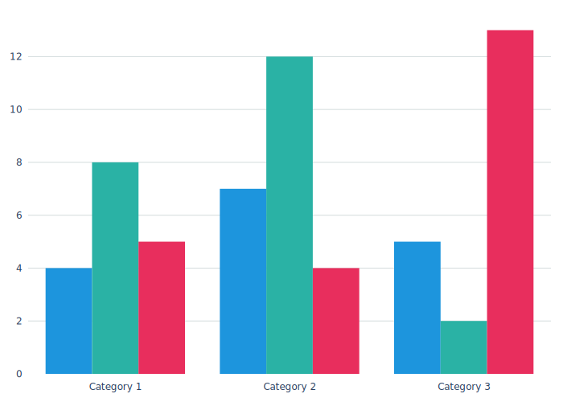

# Basic Layering

Chart configuration is a core part of making _useful_ visualizations, but it's often full of annoying boilerplate. The solution implemented in ChAsm is to treat chart configuration as a series of layers that each modify the previous, with layer0 (the base layer) being provided by the library with 100% workable defaults. This means that, in theory, you can pass data + a chart type and get something reasonable with zero additional work. 

There is no limit to the number of layers that can be provided, and there are always assumed to be two guaranteed layers.

1. layer0 (provided by the library)
2. layer1 (optional)
3. layer2 (optional)
4. ...
5. _(as many user provided layers as desired)_
6. ...
7. layerF

ChAsm provides an implicit `layer0` with sane (but opinionated) defaults. Layers 1-N are provided by the user via command line arguments or library calls and will overwrite specific settings of the layer stack. LayerF is the final layer, computed by the library and passed to the chart rendering flow.

All layers are assessed in order, and later layers take precedent over earlier layers in all cases. This algorithm provides room for some pretty convenient workflows as it allows for the creation of layers as semantic snippets. 

There could be a layer for `minimal` charts that removes axis labels, titles, and sets margins to `5`. One could also maintain a `brand_colors` layer that modifies all of the color codes to match a brand or specific style choices. These don't need to be combined in a single layer, they can simply be passed as-needed to ChAsm.

Take this command and chart from our Hello World example.

```bash
chasm make bar --data "$(cat examples/data/simple_multibar.data.json)" -o chart.svg
```



Adding config changes to show the absolute bare minimum might be maintained using a `minimal.yaml` config. 

```yaml
# File: minimal.yaml

# Chart Settings
chart_title: null
chart_margin_l: 10
chart_margin_r: 10
chart_margin_t: 10
chart_margin_b: 10

chart_layout_showlegend: false

# X-Axis Settings
chart_xaxis_title: null
chart_xaxis_visible: false

# Y-Axis Settings
chart_yaxis_title: null
chart_yaxis_visible: false
```

Which is passed as a layer to the command line results in a modified chart appearance.

```
chasm make bar --data data.json 
               -o chart.svg 
               -l minimal.yaml 
```


Layers can also overwrite each other (in order). To expand this example, I might want to keep the minimal aspects but show the legend with some extra margin on the right; to do this I could maintain a `show_legend` layer and use it _after_ the minimal layer.

```
chasm make bar --data data.json 
               -o chart.svg 
               -l minimal.yaml 
               -l show_legend.yaml 
```

```yaml
# File: show_legend.yaml

chart_layout_showlegend: true
chart_margin_r: 130
```


I might also want to apply some default colors that are better for my brand or visualization use models. There are other ways to control the colors (like via data properties), but for the basic example, updates to the core color list are a good start.

```
chasm make bar --data data.json 
               -o chart.svg 
               -l minimal.yaml 
               -l show_legend.yaml 
               -l colors.yaml
```

```yaml
# File: colors.yaml
chart_colorway:
  - "#f72585"
  - "#7209b7"
  - "#3a0ca3"
  - "#4361ee"
  - "#4cc9f0"
```


Layers must be provided in a valid YAML form, either by file path or by text (similar to the data option). Which allows for convient "no code" modifications.

```
chasm make bar --data data.json 
                -o chart.svg 
                -l minimal.yaml 
                -l show_legend.yaml 
                -l colors.yaml 
                -l "chart_title_text: 'Hello World Chart'"
```


This combination of ordering, options, and raw text allows for each user to build the workflow that works best for them. You can get as crazy (or simple) as you want. And please, build libraries, share them, make amazing workflows.

And while this is starting to look pretty cool, the data modification features are the final level of ChAsm's flexibility. 

_**#TODO:** Add link to data modification case study here_