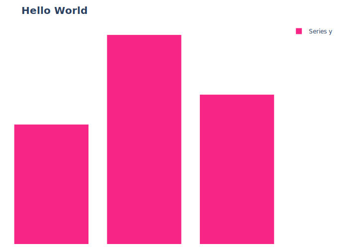
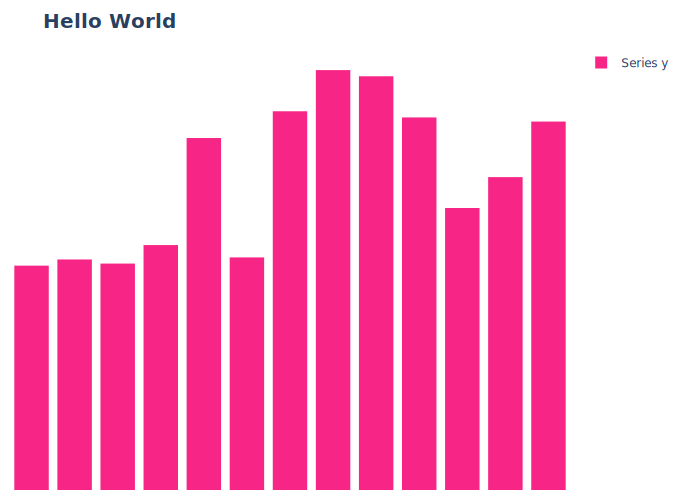
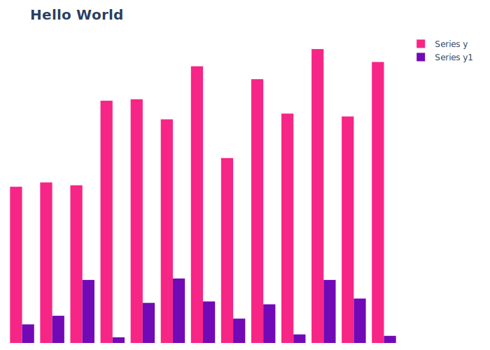

# Data Modifications

Data modifications (mods) provide an assembly-like instruction set for modifying lists of dictionaries. Things like rolling averages, summation, comparison with relative values, and other interesting algorithms can be implemented without writing any formal code. Modification instructions are broken down into both simple and complex forms to allow for maximum flexibility and ease-of-use. If you've ever played a Zachtronic game, this style of instruction combining is heavily inspired by those games. 

Instructions are provided by a text file, usually using the `.chasm` extension (though it's not required), listing one instruction per line. Lines that begin with a `#` are ignored. Instructions take the form of:

```
<type>   <instruction>   <arg1>, <arg2>, ...
```

Any type of white space can be used between elements of the instruction, though tabs are recommended for clarity. Arguments differ by instruction, but are always separated by a comma. 

Each instruction is applied to the entire data set in order. When one instruction begins, the previous instruction will have been applied to the data set for every element.

## List Instructions

List instructions are applied at the list level. For example, things like `appendrandint` will append N random integers to the end of a list. This will not affect any existing data in the list, but will modify the list as a whole.

## Item Instructions

Item instructions are applied to each individual item in the list, in the order that the list is passed to ChAsm. A basic instruction like `addint` will add an integer value to the specified key in every element of the list. 

For example, take this data set:

```
[
    { "x": "cat1", "y": 10 },
    { "x": "cat2", "y": 12 },
    { "x": "cat3", "y": 15 },
]
```

Applying the instruction `item    addint    100, y` will add 100 to every element's data at the `y` key, turning the above data set into:

```
[
    { "x": "cat1", "y": 110 },
    { "x": "cat2", "y": 112 },
    { "x": "cat3", "y": 115 },
]
```

There are lots of instructions to play with, and in combination with config layers, and the variety of chart types that this library will (eventually) contain, fairly complex charting can be done with minimal effort. 

Looking at an example, we can see a basic chart generated with the command:

```
chasm make bar --data examples/data/simple_bar.data.json -o docs/case_studies/003_data_mods/chart1.svg -l examples/layers/minimal.yaml -l examples/layers/show_legend.yaml -l examples/layers/colors.yaml -l "chart_title_text: 'Hello World'"
```



We can then apply this extend_random.chasm definition:

```
# For the entire list append 10 random values From 0 to 100 (inclusive)
list        appendrandint      10, 0, 100, x, y

# For each item add 5 to y entry
item        addint             105, y
```

Modifying the chart we see as:



This set of instructions will append 10 random values between 0 and 100 (inclusive). After the random values are added, every single entry in the list with the key of `y` will have 105 added to its value.

We could then modify the script and add an inject instruction:

```
# For the entire list append 10 random values From 0 to 100 (inclusive)
list        appendrandint      10, 0, 100, x, y

# For each item add 5 to y entry
item        addint             105, y

list        injectrandint      0, 50, y1
```



See the [Complete Listing of ChAsm ISA Instructions](../../isa/list.md).