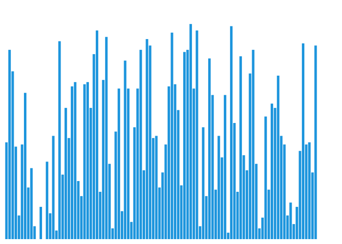
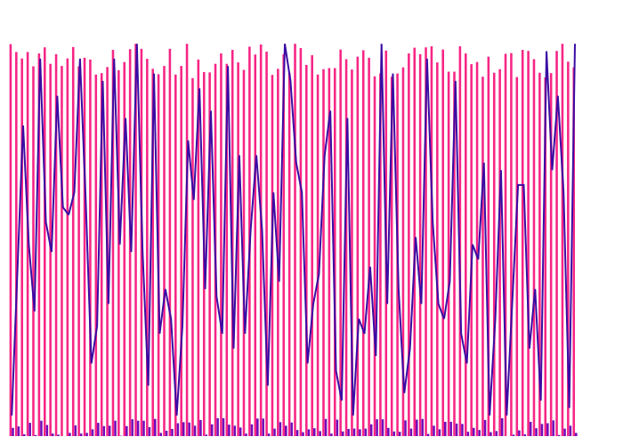
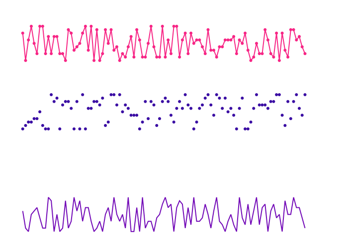

## Example 1

## Example 2

## Example 3

## Example 3

## Example 3

## Example 3

## Example 3

## Example 3

## Example 3

## Example 3

## Example 3

## Example 3

## Example 3

## Example 3

